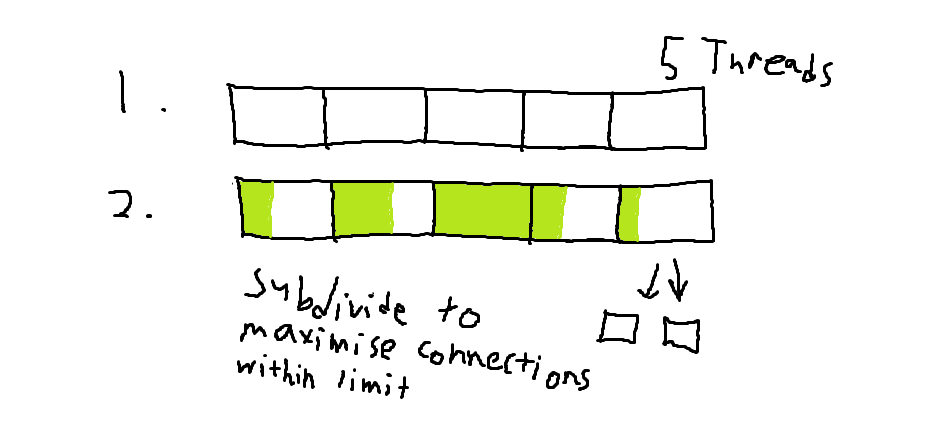

a stupidly complicated way of downloading files slightly quicker. designed to circumvent unbalanced chunk download speed.

very scientific comparison with 100mib file on [external server](https://proof.ovh.net/files/) with 20 connections (only 1 test separated by an hour to avoid cached copy):
- control (single connection browser download): ~1h
- jdownloader 2: 1m 46s (very fast at first, tapers off at the end)
- this program (production build): 26s

professional 100% inductive proof:

